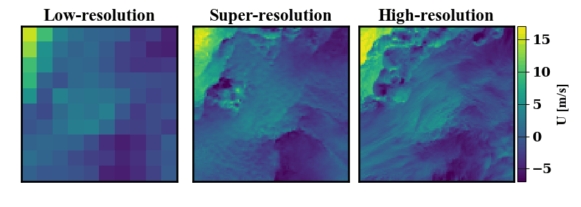

## Condititonal Physics-Informed Resolution-Enhancing GANs (PhIRE GANs)
___
### Requirements
- Python v3.7
- TensorFlow v1.12
- numpy v1.15
- matplotlib v3.1

A conda environment YML file, `tf_env.yml` has been provided for your convenience. 

### Data
Example low-resolution (LR) and high-resolution (HR) data (obtained from NREL's WIND Toolkit) can be found in `example_data/`. These data are accompanied by approximations of the sub-grid conditional moments computed via stochastic estimation. These moments are used in the training of the conditional GANs model for generating distributions of enhanced fields from coarse inputs. Test data does not need to have these conditional moments, but LR input must be in a TFRecord format. A separate tool to estimate the conditional moments is provided in `conditionalMoments/`.

### Model Weights
Pretrained model weights can be found in `models/`. The pretrained network is capable of performing a 10x super-resolution of the wind data from a 100km pixel resolution to a 10km pixel resolution. If you wish to have a different amount of super-resolution you must train the models accordingly.

### Running the Models
An example of how to use the conditional PhIRE GANs model can be found in `main.py`.
It is recommended that data is loaded in as a TFRecord (see Data).

### Demo
Contains an example of the diverse super-resolution output. The conditional moments used to generate it are obtained with neural network assisted estimation. The gif underneath shows 25 super-resolution outputs for the same input.

#### Acknowledgments
This work was authored by the National Renewable Energy Laboratory (NREL), operated by Alliance for Sustainable Energy, LLC, for the U.S. Department of Energy (DOE) under Contract No. DE-AC36-08GO28308. This work was supported by funding from DOE's Advanced Scientific Computing Research (ASCR) program and the Laboratory Directed Research and Development (LDRD) Program at NREL. The research was performed using computational resources sponsored by the Department of Energy's Office of Energy Efficiency and Renewable Energy and located at the National Renewable Energy Laboratory. The views expressed in the article do not necessarily represent the views of the DOE or the U.S. Government. The U.S. Government retains and the publisher, by accepting the article for publication, acknowledges that the U.S. Government retains a nonexclusive, paid-up, irrevocable, worldwide license to publish or reproduce the published form of this work, or allow others to do so, for U.S. Government purposes.
